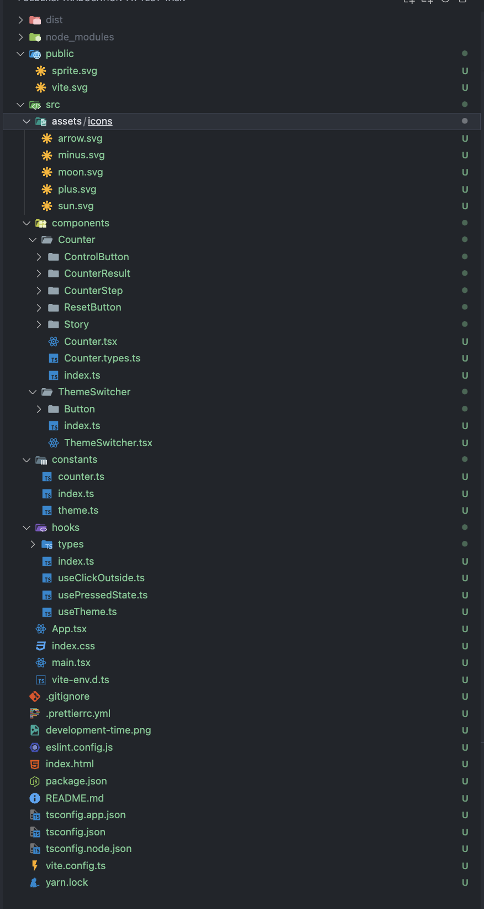
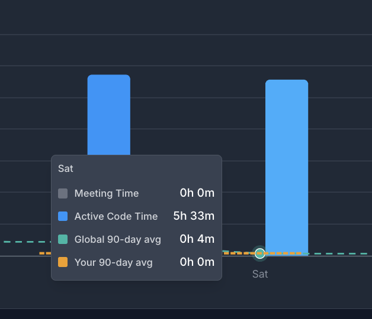

# Counter Application

A modern React application built with TypeScript that implements an interactive counter with theme customization. The application demonstrates modern React development practices, including component composition, custom hooks, and responsive design principles using Tailwind CSS.

## Features

### Counter Functionality

- Interactive counter with smooth increment and decrement controls
- Customizable step value adjustment (allows users to set how much to increment/decrement)
- Reset functionality to return to initial state
- Visual feedback for button interactions
- Maintains counter state across theme changes

### Theme System

- Dynamic Dark/Light theme switching
- Persistent theme preference storage
- Smooth transition animations between themes
- Accessible color contrasts in both themes using Tailwind CSS color palette
- SVG icons that adapt to the current theme

### User Interface

- Clean, modern design with responsive layout using Tailwind CSS
- Interactive buttons with hover and active states
- Visual feedback for all user interactions
- Fully keyboard accessible
- Mobile-friendly interface with Tailwind's responsive utilities

## Project Structure



## Getting Started

### Prerequisites

- Node.js (v14 or higher)
- Yarn package manager

### Installation

1. Clone the repository
2. Navigate to the project directory
3. Install dependencies:

```bash
yarn install
```

### Running the Application

To start the development server:

```bash
yarn dev
```

The application will be available at `http://localhost:5173`

## Technical Implementation

### Core Technologies

- **React 18**: Utilizing the latest React features
- **TypeScript**: Full type safety across the application
- **Vite**: Modern build tool for faster development
- **Tailwind CSS**: Utility-first CSS framework for styling
- **CSS Modules**: Additional scoped styling solution

### Key Implementation Details

- Component-based architecture with clear separation of concerns
- Custom hooks for theme management and click handling
- TypeScript interfaces and types for enhanced code reliability
- Tailwind CSS for rapid UI development and consistent design
- Responsive design using Tailwind's breakpoint system
- Dark/Light theme implementation using Tailwind's dark mode
- SVG sprite system for optimized icon loading
- Utility-first approach with Tailwind CSS classes

### Development Practices

- Strict TypeScript configuration for type safety
- Component composition for reusability
- Custom hooks for shared functionality
- Consistent file and folder structure
- Clear separation of concerns between components
- Tailwind CSS configuration customization for project needs

development time: 5h:33m + 1h for create env for development === 6h:33m


